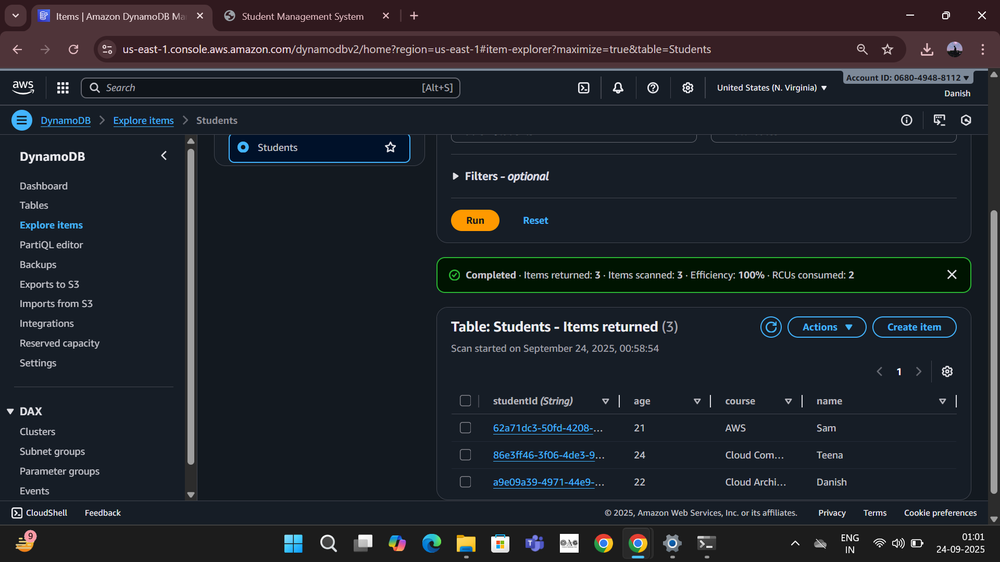
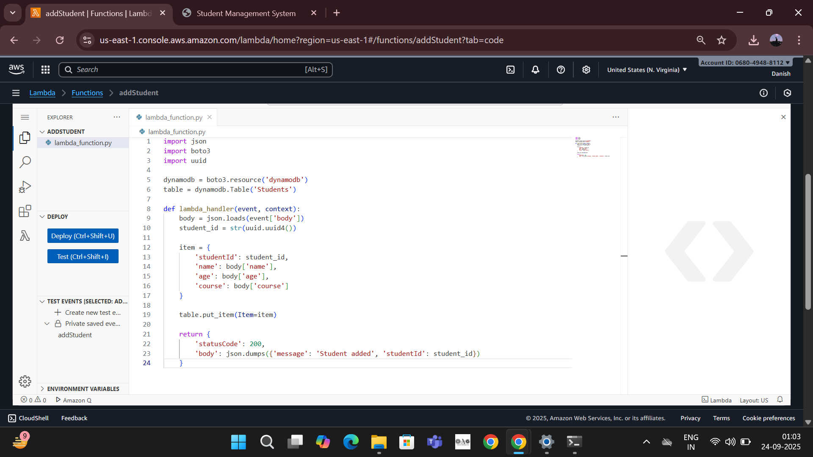
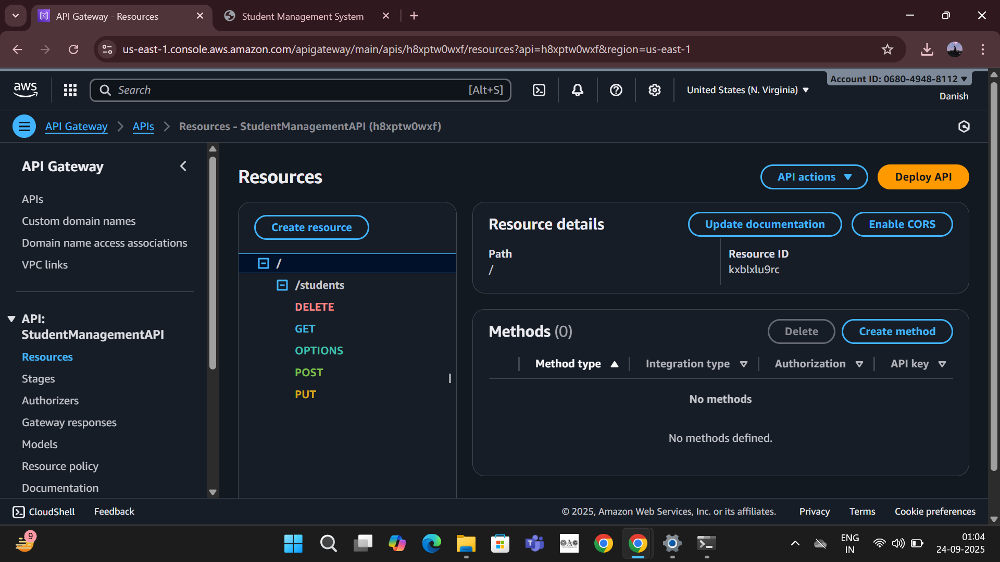
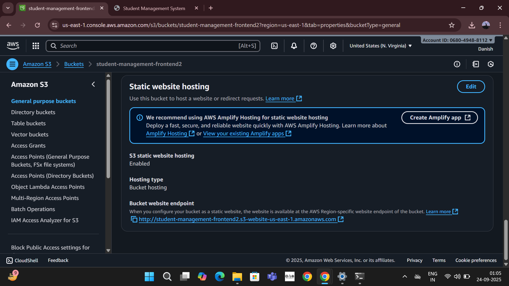
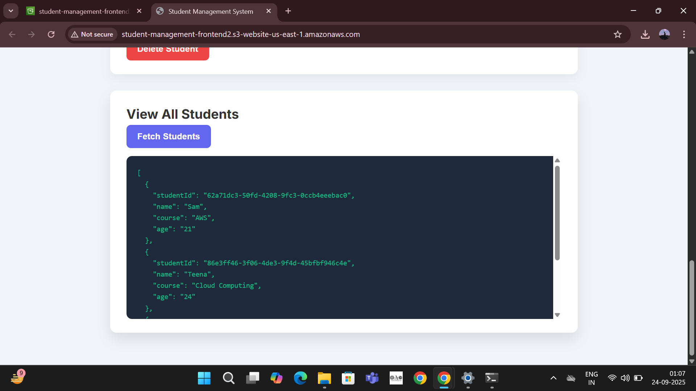

# 🎓 Student Management System (Serverless on AWS)

A **serverless CRUD application** built on AWS that allows you to **Add, View, Update, and Delete Students**.

---

## 🚀 Architecture
- **Frontend** → HTML, CSS, JavaScript (hosted on AWS S3)  
- **Backend** → AWS Lambda (Python)  
- **API Gateway** → REST API for Lambda functions  
- **Database** → DynamoDB (NoSQL)  
- **IAM** → Role-based access for security  

---

## 📂 Project Structure
student-management-system-aws/
│── backend/         # Lambda functions
│   ├── addStudent.py
│   ├── getStudents.py
│   ├── updateStudent.py
│   ├── deleteStudent.py
│── frontend/        # Static frontend hosted on S3
│   ├── index.html
│   ├── style.css
│   ├── script.js
│── screenshots/     # AWS & frontend screenshots

---

## 🛠️ Features
✅ Add a new student with name, age, and course  
✅ View all students stored in DynamoDB  
✅ Update student details by ID  
✅ Delete student by ID  
✅ Fully serverless architecture → scalable and cost-effective  

---

## ⚡ How It Works
1. **Frontend (S3)** → User fills forms / clicks buttons  
2. **API Gateway** → Sends request to correct Lambda function  
3. **Lambda** → Executes CRUD logic with DynamoDB  
4. **DynamoDB** → Stores student records  
5. Response → Displayed in browser  

---

## 📸 Screenshots

### 1. DynamoDB Table

### 2. Lambda Functions

### 3. API Gateway

### 4. S3 Hosting

### 5. Frontend in Action
- **Add Student**  

- **Fetch Students**  

